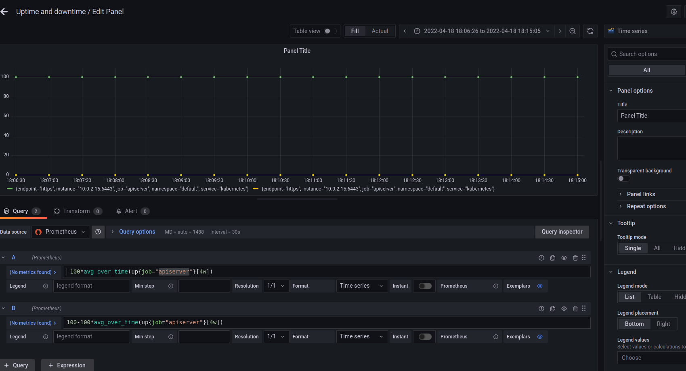

**Note:** For the screenshots, you can store all of your answer images in the `answer-img` directory.

## Verify the monitoring installation

## Setup the Jaeger and Prometheus source

## Create a Basic Dashboard

## Describe SLO/SLI
Monthly uptime SLI: how often the application was running, and was able to respond to requests (regardless of response time).
Request response time: the average time it takes endpoints to return a response after they are hit with a request.

## Creating SLI metrics.
### CPU Usage
CPU usage is one of the most classic performance metrics that can be a proxy to application responsiveness. High Server CPU usage can mean the server or virtual machine is oversubscribed and overloaded or it can mean a performance bug in your application such as too many spinlocks. Infrastructure engineers use CPU usage (along with its sister metric, memory percentage) for resource planning and measuring overall health. Certain types of applications like high bandwidth proxy services and API gateways naturally have higher CPU usage than other metrics along with workloads that involve heavy floating point math such as video encoding and machine learning workloads.

Sources:
- https://www.moesif.com/blog/technical/api-metrics/API-Metrics-That-Every-Platform-Team-Should-be-Tracking/
- https://community.grafana.com/t/simple-cpu-usage-graph/41316

### Average Memory Usage
Average MB being used per second.

Sources: 
- https://ibm-cloud-architecture.github.io/b2m-nodejs/Prometheus-Grafana/#average-memory-usage
- https://stackoverflow.com/questions/48835035/average-memory-usage-query-prometheus
### Error Rate

The rate of change of the amount of all of the requests that were not 5xx divided by the rate of change of the total amount of requests

Source: https://www.metricfire.com/blog/understanding-the-prometheus-rate-function/

### Median Response Time
The median is the middle number in a sorted, ascending or descending, list of numbers and can be more descriptive of that data set than the average.

Prometheus query: histogram_quantile(0.5, sum(rate(http_request_duration_ms_bucket[1m])) by (le, service, route, method))

Source: https://ibm-cloud-architecture.github.io/b2m-nodejs/Prometheus-Grafana/#median-response-time

### 99th percentile response time
If the 99th Percentile response time is 100ms, then out of 100 requests, 1 request took the max response time of 100 ms.

Prometheus query: histogram_quantile(0.99, sum(rate(http_request_duration_ms_bucket[1m])) by (le, service, route, method))

Sources:
- https://theflyingmantis.medium.com/what-is-99th-percentile-response-time-f23c09c3b54a
- https://ibm-cloud-architecture.github.io/b2m-nodejs/Prometheus-Grafana/#95th-response-time

## Create a Dashboard to measure our SLIs

## Tracing our Flask App

## Jaeger in Dashboards

## Report Error
TROUBLE TICKET

Name: Degraded response time

Date: 2022-03-20

Subject: Latency

Affected Area: API

Severity: Major

Description: Since release 1.2.11, 99th Percentile response time has nearly doubled from 92ms to 172ms. We must:
- Find out and document the root cause.
- Make the changes needed to meet our SLO of a 99th percentile response time below or equal to 100ms.

## Creating SLIs and SLOs
*TODO:* We want to create an SLO guaranteeing that our application has a 99.95% uptime per month. Name four SLIs that you would use to measure the success of this SLO.

1. Uptime (availability) - what percent of requests are returned without error
2. Median 50th Percentile Latency
3. Median 90th Percentile Latency
4. Median 99th Percentile Latency

Source: https://emmer.dev/blog/slis-slos-and-slas-what-are-they/

## Building KPIs for our plan
1. Uptime: 100*avg_over_time(up{job="some_job"}[4w])
2. Downtime: 100-100*avg_over_time(up{job="some_job"}[4w])

Sources:
- https://www.ibm.com/docs/en/cloud-private/3.1.2?topic=apis-prometheus-api
- https://stackoverflow.com/questions/65620289/how-to-get-up-metric-count-0-for-last-week-from-prometheus
- https://stackoverflow.com/questions/58080200/how-to-get-overall-uptime-of-a-server-with-prometheus-and-node-exporter

## Final Dashboard

